# Reports

Report definitions and templates in account_financial_report.

```mermaid
classDiagram
    class VATReportXslx
    AbstractModel <|-- VATReportXslx
    class VATReport
    AbstractModel <|-- VATReport
    class AgedPartnerBalanceXslx
    AbstractModel <|-- AgedPartnerBalanceXslx
    class OpenItemsXslx
    AbstractModel <|-- OpenItemsXslx
    class AgedPartnerBalanceReport
    AbstractModel <|-- AgedPartnerBalanceReport
    class JournalLedgerReport
    AbstractModel <|-- JournalLedgerReport
    class TrialBalanceXslx
    AbstractModel <|-- TrialBalanceXslx
    class OpenItemsReport
    AbstractModel <|-- OpenItemsReport
    class GeneralLedgerXslx
    AbstractModel <|-- GeneralLedgerXslx
    class TrialBalanceReport
    AbstractModel <|-- TrialBalanceReport
    class GeneralLedgerReport
    AbstractModel <|-- GeneralLedgerReport
    class AbstractReportXslx
    AbstractModel <|-- AbstractReportXslx
    class AgedPartnerBalanceReport
    AbstractModel <|-- AgedPartnerBalanceReport
    class JournalLedgerXslx
    AbstractModel <|-- JournalLedgerXslx
```

## Available Reports

No named reports found in XML files.

## Report Files

- **abstract_report.py** (Python logic)
- **abstract_report_xlsx.py** (Python logic)
- **aged_partner_balance.py** (Python logic)
- **aged_partner_balance_xlsx.py** (Python logic)
- **general_ledger.py** (Python logic)
- **general_ledger_xlsx.py** (Python logic)
- **__init__.py** (Python logic)
- **journal_ledger.py** (Python logic)
- **journal_ledger_xlsx.py** (Python logic)
- **open_items.py** (Python logic)
- **open_items_xlsx.py** (Python logic)
- **aged_partner_balance.xml** (XML template/definition)
- **general_ledger.xml** (XML template/definition)
- **journal_ledger.xml** (XML template/definition)
- **layouts.xml** (XML template/definition)
- **open_items.xml** (XML template/definition)
- **trial_balance.xml** (XML template/definition)
- **vat_report.xml** (XML template/definition)
- **trial_balance.py** (Python logic)
- **trial_balance_xlsx.py** (Python logic)
- **vat_report.py** (Python logic)
- **vat_report_xlsx.py** (Python logic)

## Notes
- Named reports above are accessible through Odoo's reporting menu
- Python files define report logic and data processing
- XML files contain report templates, definitions, and formatting
- Reports are integrated with Odoo's printing and email systems
