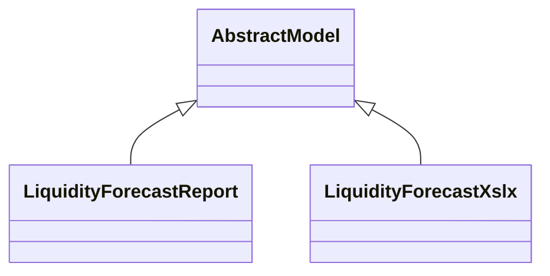

# Reports

Report definitions and templates in account_liquidity_forecast.

## Available Reports

No named reports found in XML files.

## Report Files

- **__init__.py** (Python logic)
- **liquidity_forecast.py** (Python logic)
- **liquidity_forecast_xlsx.py** (Python logic)
- **layouts.xml** (XML template/definition)
- **liquidity_forecast.xml** (XML template/definition)

## Notes
- Named reports above are accessible through Odoo's reporting menu
- Python files define report logic and data processing
- XML files contain report templates, definitions, and formatting
- Reports are integrated with Odoo's printing and email systems
