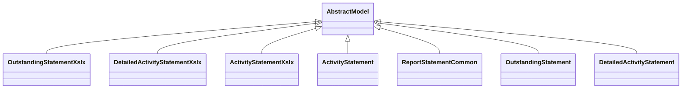

# Reports

Report definitions and templates in partner_statement.

## Available Reports

No named reports found in XML files.

## Report Files

- **activity_statement.py** (Python logic)
- **activity_statement_xlsx.py** (Python logic)
- **detailed_activity_statement.py** (Python logic)
- **detailed_activity_statement_xlsx.py** (Python logic)
- **__init__.py** (Python logic)
- **outstanding_statement.py** (Python logic)
- **outstanting_statement_xlsx.py** (Python logic)
- **report_statement_common.py** (Python logic)

## Notes
- Named reports above are accessible through Odoo's reporting menu
- Python files define report logic and data processing
- XML files contain report templates, definitions, and formatting
- Reports are integrated with Odoo's printing and email systems
