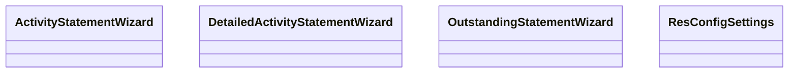

# Wizards

Transient models exposed as UI wizards in partner_statement.

```mermaid
classDiagram
    class ActivityStatementWizard
    class DetailedActivityStatementWizard
    class OutstandingStatementWizard
    class ResConfigSettings
```
