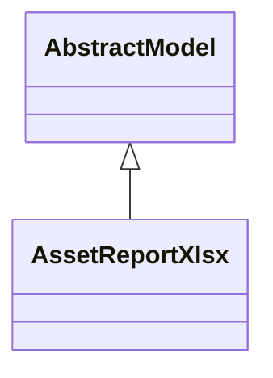

# Reports

Report definitions and templates in account_asset_number.

## Available Reports

### PDF/Document Reports
- **Asset Number (PDF)** (PDF/Print)

## Report Files

- **account_asset_number_report.xml** (XML template/definition)
- **account_asset_report_xls.py** (Python logic)
- **__init__.py** (Python logic)

## Notes
- Named reports above are accessible through Odoo's reporting menu
- Python files define report logic and data processing
- XML files contain report templates, definitions, and formatting
- Reports are integrated with Odoo's printing and email systems
